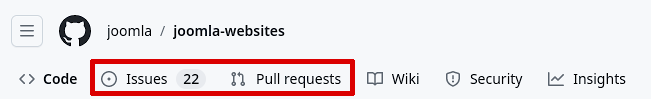

# [WiP] Joomla GitHub workflow suggestion

There is a [description of Git and GitHub](https://docs.joomla.org/Working_with_git_and_github) in the Joomla documentation, originally written for developers, which also explains how to set up a test environment.
A second page has an example of how to [create a pull request with GitHub](https://docs.joomla.org/Using_the_Github_UI_to_Make_Pull_Requests).
Since November 2022, Joomla has been using the new [communication system](https://joomlacommunity.cloud.mattermost.com) based on Mattermost. If you haven't registered there yet, [this JCM article](https://magazine.joomla.org/all-issues/november-2022/getting-the-most-out-of-mattermost) describes the way. Communication there is organised through various channels. Feel free to ask the Joomla development teams there how you can contribute to the Joomla project.

**The purpose of this How To is to describe the pull request workflow (step by step) and also the main tasks that could be done within it to make it easier for you to help with Joomla.** 

## Starting from Scratch

If you want to participate in the GitHub workflow, there are a few things you need to do first. 
* You will of course need a (free) [GitHub account](https://github.com/join)
* Use GPG, SSH or S/MIME for tag and commit signing
* Then you should have [Git](https://git-scm.com/downloads) installed on your local machine
* Of course you need a [suitable editor](#editor) for working with it

On Github, almost every repository has two places to contribute your ideas or work to the project:
* **Issues** You have an idea that is not yet fully developed, but you want to present it to the community. The right way to do this is to open a new issue. The same applies if you have found a bug or want to suggest a new feature.
* **Pull Requests** If you already have finished code or a concrete improvement, you can also start a pull request. 

The number of tabs in the header depends on what options the owners of a repository have enabled. For example, in addition to Issues, Pull Requests and Wiki, there might be Discussions, Projects or Actions. For each section, the maintainers can allow contributions from authorised users only, or from any users.

## Quickstart

For urgent and experienced users/developers, here are the recommended steps (described in more detail below)
1. fork the target repository to your own GitHub account (use a unique name).
2. clone that fork to your local workstation
3. create a new local branch based on the target branch 
4. do your work on that branch as planned
5. commit to the local branch to complete the work for now.
6. your work should then be pushed to your GitHub account
7. a pull request can now be made to the maintainers of the target repo
8. in the best case, your work will be so strong that your PR will be accepted as is (i.e. merged) - if change requests are made, please read [here for details](#requests) 
9. if accepted, your working branch can be removed with confidence - your work is now included in the target branch.

## Prerequisites to participate in the Joomla GH workflow
1. **Sign up for GitHub** It sounds so obvious, but it's the little things that can make using your account more convenient and secure. [GitHub's extensive help pages](https://docs.github.com/en/authentication/keeping-your-account-and-data-secure/about-authentication-to-github) can help you with this.
2. **Commit Signature Verification** Many GH repositories require their contributors to sign their commits – the Joomla repositories are among them. It is hard to argue against the sense of this step. Only one advantage should be mentioned here. It is made (almost) impossible to launch [MITM](https://en.wikipedia.org/wiki/Man-in-the-middle_attack) (man-in-the-middle) attacks. The [GitHub pages](https://docs.github.com/en/authentication/managing-commit-signature-verification/about-commit-signature-verification) also have detailed help on this topic.
Depending on the operating system and IDE/editor you use, there are different ways to set up automatic commit verification. In unclear situations, the community or relevant forums will certainly help.
3. **Have Git Installed** (optional but strongly recommended) [Git is a VCS](https://git-scm.com/) (Version Control System) that helps track changes to revision levels in software development. GitHub is, in simple terms, a cloud platform that provides Git repositories for collaboration worldwide. You can also contribute to the Joomla repositories without having your own Git instance. But you will quickly notice that Git can make a lot of things easier for you. 
The many new Git CLI commands may seem daunting to some. However, there are good [GUI clients](https://git-scm.com/downloads/guis) (both free and proprietary) for most operating systems that can help you get started. For Windows or Mac users, it can't be bad to take a look at the free [GitHub Desktop](https://desktop.github.com/). For those who want (or need) to delve a bit deeper into Git, I recommend studying the [Progit2 book](https://git-scm.com/book/en/v2) (with many translations). **Tip:** It is best to have Git installed *before* you start to fork and clone a repository.
1. **Choosing an Editor** You are spoilt for choice - but you have to exclude word processors such as MS Word or OpenOffice Writer, which do not produce plain text but embed it in formatting code. The simplest applications, such as TextEdit on MacOS or Editor on Windows, can produce plain text. The many alternatives each have their own advantages and disadvantages. It is difficult to list just a few here. If you develop software professionally, you will probably use the free [Eclipse](https://en.wikipedia.org/wiki/Eclipse_(software)) or [PHPStorm](https://www.jetbrains.com/phpstorm/) (for a fee), some prefer an [IDE](https://en.wikipedia.org/wiki/Integrated_development_environment), others a simple editor. A cross between an IDE and an editor is Microsoft's free [VSCode](https://code.visualstudio.com/#alt-downloads), available for MacOS, Linux and Windows. Those of you who are concerned about MS's authorship and telemetry reporting can also switch to the open source variant [VSCodium](https://vscodium.com/), which is almost equal in code. You can "build" your own environment using a wide range of extensions. 
Further information:
The JCM (Joomla Community Magazine) has published the article [VSCode - Use it like a pro!](https://magazine.joomla.org/all-issues/may-2021/vs-code-use-it-like-a-pro) and in the Joomla documentation there are the pages [Visual Studio Code Primer](https://docs.joomla.org/Visual_Studio_Code_Primer) and [Visual Studio Code](https://docs.joomla.org/Visual_Studio_Code). Some extensions are introduced from different perspectives.

## 1. Forking a Repository – Why?
Quite simply - because you **don't have**, and **never will have**, permission to change anything in a repository unless you are the owner or maintainer of that repository.
The fork of a repository is an exact copy of the original repository (as long as you don't change anything). In your fork, which is linked to your account, you are now free to change whatever you like (within the limits of what is legally allowed).

#### let's show how to fork a repo
On GitHub.com, navigate to the repository you want to fork
Select the "Fork" button (or the triangle to the right of it if you require options) and **create a new fork**.

Next we need to give the new fork a name and optionally enter a description.
**Tip:** By default the "Copy *master* branch only" checkbox is selected. If you want to fork all branches, uncheck this.

## 2. Cloning my GitHub Repository – Why?
Do you want to be able to work comfortably and be allowed to make an occasional mistake without it becoming known around the world? 
Want to use your favourite IDE/editor?
Do you have an unreliable or slow internet connection?
If you can answer yes to just one of these three questions, then a locally cloned repository is a good choice.

The actual cloning can be done in up to 5 different ways, **starting from your just forked GitHub repository**. 
With VSCode/VSCodium (or other IDEs) you can also clone the target repository to your local machine without an existing fork. However, you will only be able to push your work to your own account. The result is the same, just the order of the steps can be reversed. This last option is not recommended for inexperienced users, as some important settings are not set automatically. You will have to do the necessary configuration manually.

#### Let's get back to the alternatives that GitHub offers:

The choice is based on the method you use to log in to GitHub. You are expected to have Git installed on your computer.
* **Clone via HTTPS** 
* **Clone via SSH**
* **Clone via GitHub CLI**
* **Open with GitHub Desktop**
* **Download ZIP** file do

See more details on [GitHub](https://docs.github.com/en/get-started/quickstart/fork-a-repo#cloning-your-forked-repository). The follow up to this article will also explain how to sync your local clone with your GitHub repo (called Origin) and the target repo (called Upstream). 

## 3. Create a New Local Branch – Why?
Let's say you have an idea that needs to be integrated into Joomla. You work on it, but for some reason you have to take a break. After a few days or weeks, you are finally done.
In the meantime, the developers have moved on and decided that your idea needs improvement and will not be included in the next release, but only in the one after that. Now, however, your main branch is no longer in sync with Joomla's main branch. You also need to merge the current version of the next-but-one Joomla development branch with your work. 
If you have inadvertently been working on the main branch of the current release, your work will be lost. With a second branch, it is easy to migrate to the next-but-one release without affecting the main branch. 
The more developers working on a common project, the more difficult it would be to coordinate without the branching model (this is described in detail in chapter 3 of the aforementioned Progit2 book).

<!---
##### if changes are requested
-->

